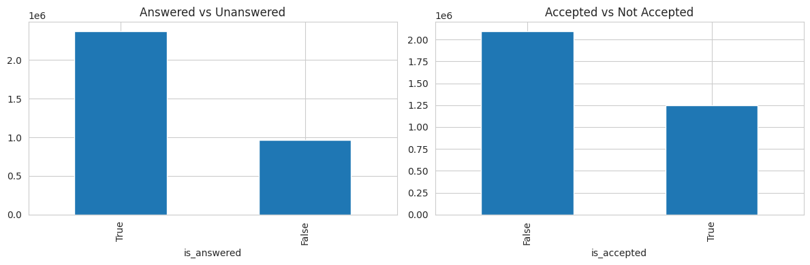
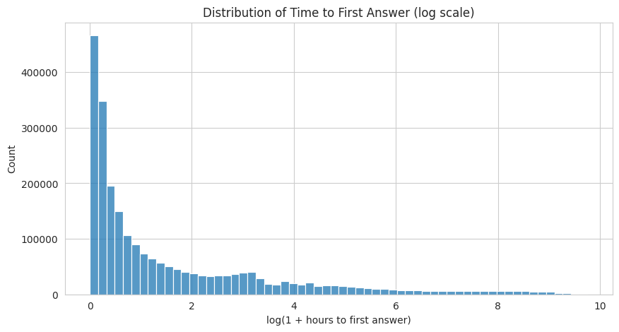
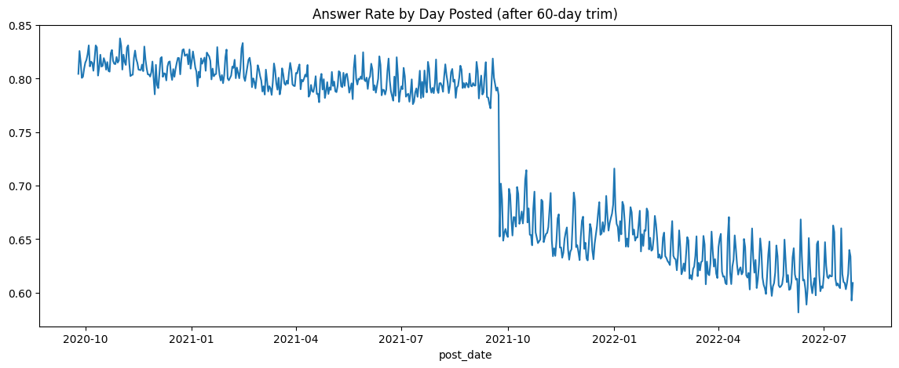
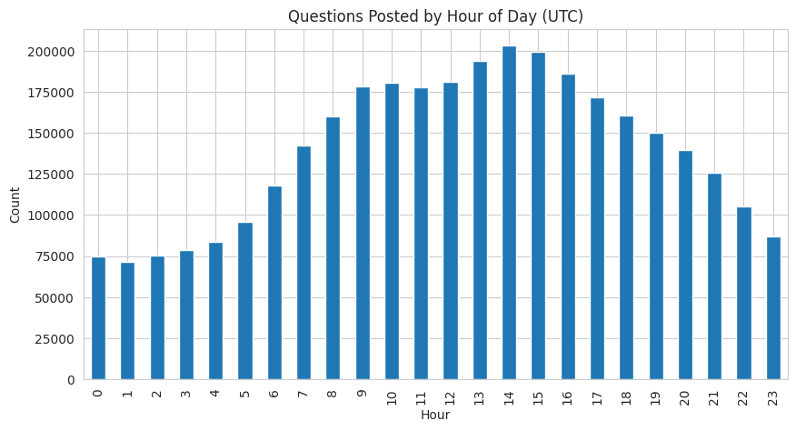
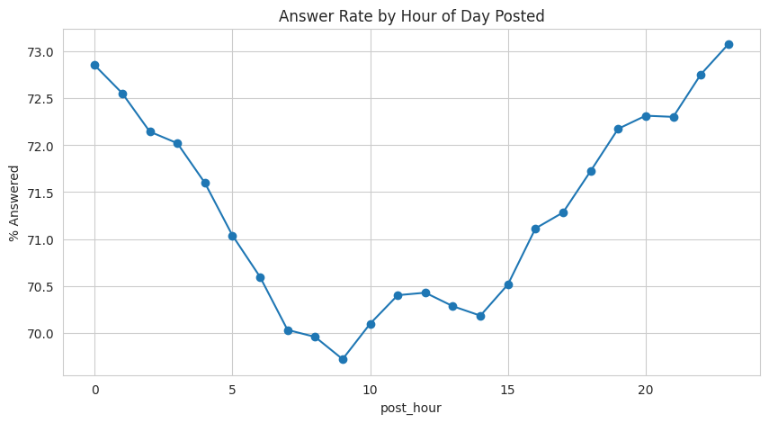
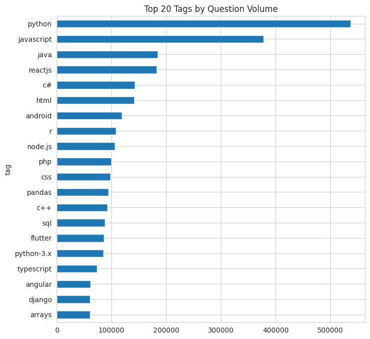
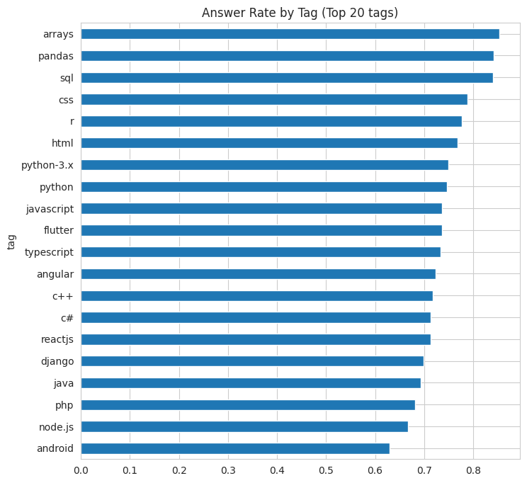
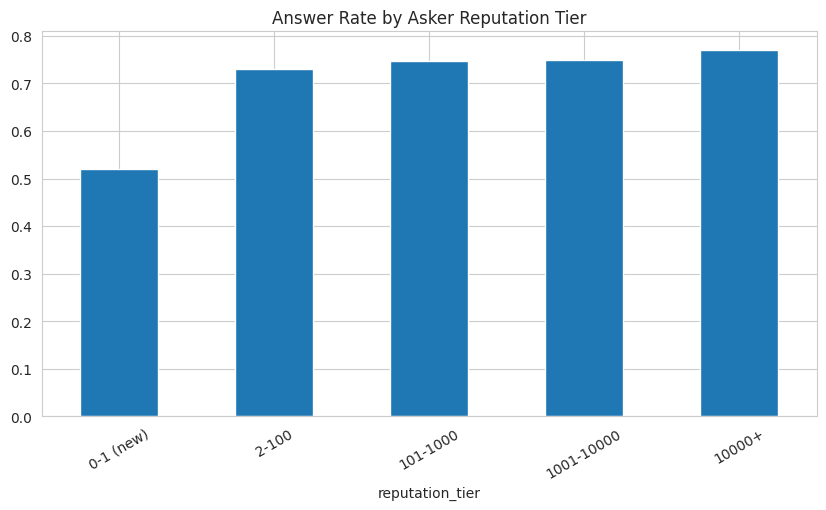
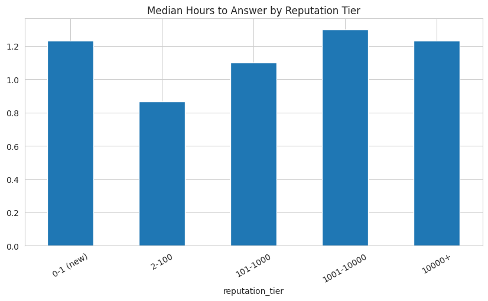
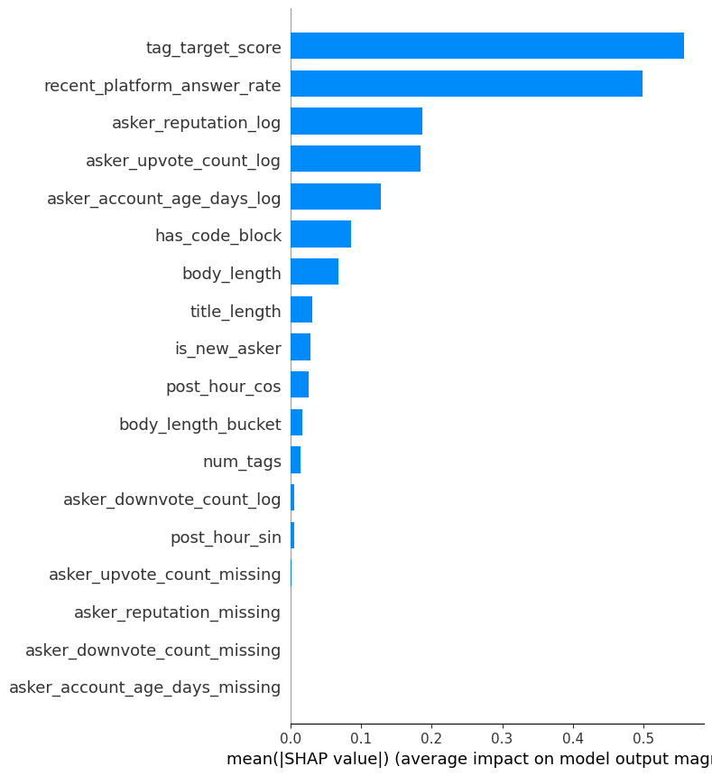

# Findings: EDA, Data Quality, and Statistical Testing

This document walks through the analytical process behind the Stack Overflow Answer Predictor: the exploratory analysis, the data quality issues that turned up along the way, and the statistical tests used to confirm (or in a couple of cases, correct) each finding before it was allowed to shape feature engineering or modeling. See the root [README.md](README.md) for the project overview and live links.

Dataset: `bigquery-public-data.stackoverflow` (Google BigQuery's public dataset), questions posted between 2020-09-25 and 2022-09-25. This is a static snapshot, which matters a lot for one of the findings below. Query: [`sql/01_questions_base.sql`](sql/01_questions_base.sql).

## 1. Target variable overview

About 71.1 percent of questions receive some answer, but only 37.3 percent receive a formally accepted answer. Of the questions that do get answered, only about half (52.4 percent) are ever marked accepted. The other 47.6 percent got real help that the asker simply never went back and accepted.

That gap is why `is_answered`, not "accepted," was chosen as the primary classification target. It's a much more complete measure of whether a question actually got help.


*Exported from the notebook's "Target variable analysis" section.*

## 2. Time to answer

The distribution is heavily right skewed: the mean is 169 hours, but the median is just 1 hour. About half of eventually-answered questions are answered within an hour, and 92.5 percent are answered within a week.

Twelve rows had a negative `hours_to_first_answer`, a small data anomaly affecting about 0.0005 percent of rows. These were filtered out using a mask that specifically preserved unanswered rows (`(hours >= 0) | (is_answered == False)`), rather than a naive filter that would have quietly dropped every unanswered question along with the twelve bad ones.


*Exported from the notebook's log-scale histogram.*

## 3. A closer look at time: two different problems hiding in the same chart

This was the most important investigative finding in the project. Two separate phenomena show up in the same chart, and they needed two different diagnoses and two different fixes.


*Exported from the notebook, the daily rate plot over the trimmed date range.*

### 3a. A real structural break around September 2021

The daily answer rate holds fairly steady around 80 to 83 percent from the start of the dataset through about September 2021, then drops sharply to somewhere between 63 and 70 percent, and keeps drifting down to around 60 percent by mid-2022. This lines up with independent, external reporting of a broader decline in Stack Overflow activity around that same period, following the platform's 2021 sale to Prosus and coinciding with the early rise of AI coding assistants. Because this looks like a real shift rather than a data artifact, it wasn't corrected or smoothed away. Instead, it shaped two decisions:

- Using a chronological train, validation, and test split instead of a random one.
- Adding a rolling 30-day recent-answer-rate feature (`recent_platform_answer_rate`) so the model can sense whether the current environment looks favorable, without hardcoding a calendar date that wouldn't mean anything for future deployment.

### 3b. Right-censoring near the end of the dataset

Because this is a static snapshot ending 2022-09-25, questions posted in the final weeks of that window simply hadn't had time to accumulate their eventual answers yet. This was confirmed directly:

| Window before cutoff | Observed answer rate |
|---|---|
| Last 7 days | 46.0 percent |
| Last 30 days | 52.4 percent |
| Last 90 days | 58.1 percent |
| More than 180 days before cutoff | 74.8 percent (the true baseline) |

The fix was to exclude the final 60 days of the dataset from training and evaluation entirely, since this drop is a data completeness problem, not a real signal about how the platform was behaving.

## 4. Time of day and day of week

Question volume peaks between 9:00 and 16:00 UTC. Interestingly, the answer rate is actually lowest during those same peak hours (around 69.7 to 70.7 percent) and highest during the quieter overnight hours (around 72.5 to 73 percent), which suggests a supply and demand effect: more questions competing for the same pool of people willing to answer. The day-of-week effect is smaller, with a modest bump on Saturdays and Sundays.




## 5. Tag effects

Python and JavaScript dominate by volume. Among the top 20 tags, `android` stands out for the wrong reasons: it has both the lowest answer rate (around 63 percent) and the highest median time to answer (around 1.7 hours), and those are two independently computed metrics agreeing with each other. On the other end, `pandas`, `arrays`, and `sql` are both fast and reliably answered.

 


This pattern is what motivated `tag_target_score`, a walk-forward, leakage-safe target-encoded feature that turned out to be by far the most important feature in both trained models.

## 6. Text features: code blocks and question length

About 82.3 percent of questions already contain a code block, which is a high base rate to begin with. Having a code block is associated with a 10.6 percentage point higher answer rate (72.9 percent versus 62.3 percent).

A chi-square test of independence confirmed the association (chi-square of 26,915.20, p close to zero), but with a sample size around 3.34 million, a p-value alone doesn't tell you much. Cramer's V came out to 0.090, which is a weak effect size. It's real, but it's not doing most of the work on its own.

Body length told a more interesting story: it has a non-monotonic, inverted-U relationship with answer rate. Both very short and very long questions underperform questions of moderate length. A proportions z-test comparing the best-performing quintile (72.83 percent answered) against the longest quintile (68.33 percent answered) gave a Z of 57.01 with p close to zero, confirming this is a genuine 4.5 percentage point gap rather than noise.


## 7. Asker reputation

Reputation is extremely right skewed, with a mean of 1,299 but a median of just 59, and a max of 1.36 million. Looking at answer rate by reputation tier reveals something closer to a sharp newcomer penalty than a smooth gradient:

| Reputation tier | Answer rate | Change from prior tier |
|---|---|---|
| 0 to 1 (new) | 51.9 percent | |
| 2 to 100 | 73.0 percent | plus 21.1 points |
| 101 to 1,000 | 74.7 percent | plus 1.6 points |
| 1,001 to 10,000 | 74.8 percent | plus 0.2 points |
| 10,000 plus | 77.0 percent | plus 2.2 points |

A chi-square test (chi-square of 92,803.51, p close to zero, Cramer's V around 0.168) and a Cochran-Armitage trend test (Z of 209.85) confirm there's a real, if front-loaded, directional trend here.

### Is this just a proxy for question quality?

That was worth checking directly rather than assuming. A logistic regression that controlled for body length, code block presence, tag count, and title length barely moved the reputation-tier odds ratios from their unadjusted values. For example, the 2 to 100 tier went from an unadjusted odds ratio of about 2.51 to an adjusted odds ratio of 2.42.

| Tier | Adjusted odds ratio versus 0 to 1 reputation | 95 percent confidence interval |
|---|---|---|
| 2 to 100 | 2.42 | 2.36 to 2.47 |
| 101 to 1,000 | 2.57 | 2.50 to 2.63 |
| 1,001 to 10,000 | 2.53 | 2.46 to 2.61 |
| 10,000 plus | 3.01 | 2.84 to 3.19 |

So reputation carries a real, independent association with getting answered. It isn't just standing in for question quality. That said, the model's pseudo R-squared was low, only 0.028, which means these factors together still explain a fairly small share of the total variance. The full LightGBM model captures a lot more than this simpler regression could.



### A counterintuitive finding about speed

Among questions that do get answered, the fastest median response time belongs to the 2 to 100 reputation tier (about 0.87 hours), not the highest-reputation users. The 1,001 to 10,000 tier is actually the slowest (about 1.30 hours), even slower than brand-new askers (about 1.23 hours).

A Kruskal-Wallis test (H of 6,941.61, p close to zero) confirmed the five tiers don't share a distribution, and Bonferroni-corrected pairwise Mann-Whitney U tests confirmed the specific gap between the 0-1 tier and the 1,001 to 10,000 tier is real (corrected p of 0.0046).

One plausible explanation, offered here as a hypothesis rather than a proven mechanism: this could be a selection effect. New users' questions that do get answered tend to be the simpler ones that survived the "will this get answered at all" filter. Moderately experienced users may be asking harder, more specific questions that take longer to resolve even when they do eventually succeed. In other words, reputation here might be less a direct cause of speed and more a variable tangled up with how difficult the underlying question actually is.



## 8. What the models actually rely on

The full training methodology, threshold tuning, and calibration details live in the training notebooks (see the README for Kaggle links). The headline results:

For classification, the dominant features by SHAP value were `tag_target_score`, `recent_platform_answer_rate`, `asker_reputation_log`, and `asker_upvote_count_log`. It's worth noting that gain-based importance and SHAP-based importance disagreed slightly on the ordering of two correlated features, `asker_reputation_log` and `asker_upvote_count_log`. SHAP is treated as the more trustworthy measure here, since it splits credit more fairly across correlated inputs than gain-based splitting does.

For the regression model, `tag_target_score` dominates even more heavily, and the rolling recent-context features that mattered so much for classification contribute comparatively little. That suggests the 2021 platform decline affected whether questions get answered more than it affected how fast they get answered once they do.



## 9. Summary of statistical tests used

| Finding | Test | Why this test |
|---|---|---|
| Code block and answer likelihood | Chi-square plus Cramer's V | Two categorical variables, and an effect size was needed since the large sample size makes the p-value alone uninformative |
| Reputation tier and answer likelihood | Chi-square plus Cochran-Armitage trend test | The groups are ordinal, so a trend test checks for a genuine monotonic direction rather than just "the groups differ" |
| Reputation tier and speed | Kruskal-Wallis plus Bonferroni-corrected pairwise Mann-Whitney | Time-to-answer is heavily right skewed, which violates the normality assumption behind ANOVA |
| Whether reputation is confounded by question quality | Logistic regression, comparing adjusted and unadjusted odds ratios | This directly tests whether an effect survives once other variables are controlled for |
| Body length and the inverted-U pattern | Proportions z-test comparing the peak quintile to the longest quintile | This tests the specific two-group claim behind the visual pattern, rather than relying on the chart alone |

## Regenerating the images in this document

The charts referenced above came from the EDA and statistical testing notebooks (see the README for Kaggle links). To export them as image files, add a `plt.savefig(...)` call right before each `plt.show()`, for example:

```python
plt.savefig('docs/images/ans_rate_by_day.png', dpi=150, bbox_inches='tight')
plt.show()
```
